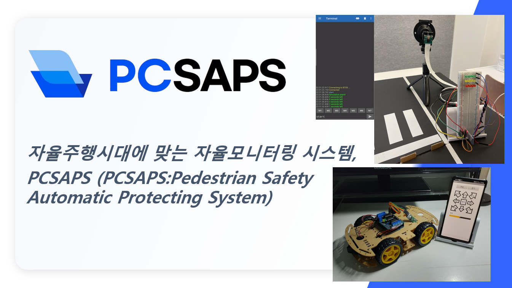

#  Autonomous monitoring system suitable for the autonomous driving era, PCSAPS : 보행자보호시스탬 - UnderDog(Team)

   
 	
   

## ✨Abstract(작품개요)
창의공학설계 텀프로젝트- PCSAPS(보행자보호시스템) 설계제작 및 구현

### 💻Architecture(아키텍처)

위 작품에 대한 아키텍처를 그려넣어주세요!

### 🎮Functions(기능)

### 💡Getting Started(시작하기)

어떻게 실행하는지 적어주세요!

### 💡Prerequisites(개발환경)

설치해야할 프로그램 및 빽단에 대한 조치들을 적어주세요! 
예를 들어,
- [miniconda 3.9.12](https://docs.anaconda.com/miniconda/release-notes/)
- [WSL: Ubuntu 20.04](https://wikidocs.net/219899)

### 💡Demo(시연영상)

   
 	
   

### 📑Contributing(기여 및 업무분장)

누가 어떻게 기여했는지 적어주세요!

## ※Appendix

### I. Q&A(질의응답)

### II. Flow Chart(순서도)

### Referenced Papers and Patents(참고논문 및 특허)
(참고문헌은 `IEEE`스타일로 작성합니다)

  - **Billie Thompson** - *Provided README Template* -
    [PurpleBooth](https://github.com/PurpleBooth)
